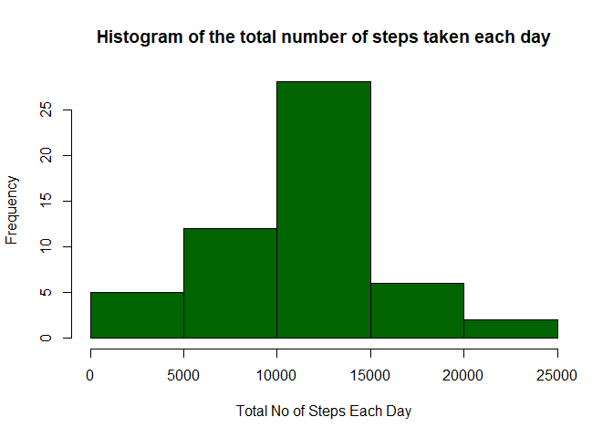
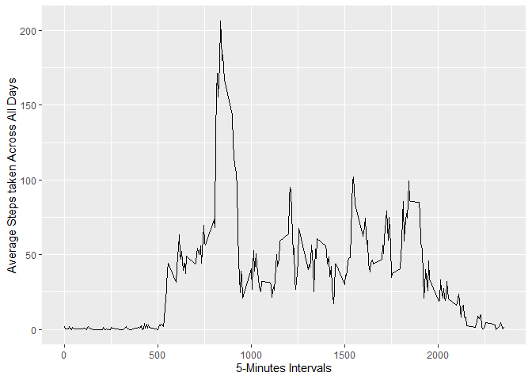
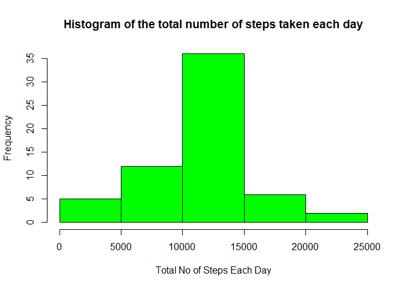
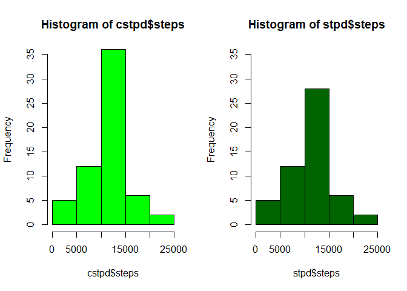

## Loading and preprocessing the data
### The data used for this assignment was obtained from [Activity monitoring data](https://d396qusza40orc.cloudfront.net/repdata%2Fdata%2Factivity.zip) of the course website. To load the data iinto R, the following code was used

```r
actData <- read.csv(unz("activity.zip", "activity.csv"), header = TRUE, sep = ",")
```
#### Check the data

```r
summary(actData)
```

```
##      steps                date          interval     
##  Min.   :  0.00   2012-10-01:  288   Min.   :   0.0  
##  1st Qu.:  0.00   2012-10-02:  288   1st Qu.: 588.8  
##  Median :  0.00   2012-10-03:  288   Median :1177.5  
##  Mean   : 37.38   2012-10-04:  288   Mean   :1177.5  
##  3rd Qu.: 12.00   2012-10-05:  288   3rd Qu.:1766.2  
##  Max.   :806.00   2012-10-06:  288   Max.   :2355.0  
##  NA's   :2304     (Other)   :15840
```

```r
sapply(actData, class)
```

```
##     steps      date  interval 
## "integer"  "factor" "integer"
```
#### the date will be changed from 'factor' to 'date'

```r
actData$date <- as.Date(as.character(actData$date), "%Y-%m-%d")
```


## What is mean total number of steps taken per day?

#### To genarate the total steps taken each day, the code is as shown below was used

```r
stpd <- aggregate(steps ~ date, actData, FUN = sum)
```

#### This is the code used to plot the histogram

```r
hist(stpd$steps, col = "dark green", main = " Histogram of the total number of steps taken each day ", 
     xlab = "Total No of Steps Each Day")
```

<!-- -->

#### To check the summary amd obtain the mean and median

```r
summary(stpd$steps)
```

```
##    Min. 1st Qu.  Median    Mean 3rd Qu.    Max. 
##      41    8841   10765   10766   13294   21194
```
#### The mean and median from the above summary is **10766** and **10765** respectively.


## What is the average daily activity pattern?

#### To genarate the five minutes interval and average steps taken each day, the code is as shown below was used

```r
AvgInt <- aggregate(steps ~ interval, actData, FUN = mean)
```

#### Then a plot of the 5-minute interval on x-axis and the average number of steps taken, averaged across all days on y-axis is done

```r
library(ggplot2)
```

```
## Warning: package 'ggplot2' was built under R version 3.6.3
```

```r
ggplot(AvgInt, aes(interval, steps)) + geom_line() +xlab("5-Minutes Intervals") + ylab("Average Steps taken Across All Days")
```

<!-- -->

#### To find the maximum steps on 5-minute intervals:

```r
maxi <- AvgInt$interval[which.max(AvgInt$steps)]
```
#### From the code above, maxi, the 5-minute interval, on average across all the days in the dataset, that contains the maximum number of steps is **835**


   
   
## Imputing missing values

#### To find the missing values the code 

```r
MisVal <- sum(is.na(actData$steps))
```
#### was used. Therefore, the total number of missing values in the dataset (i.e. the total number of rows with NAs) **2304**.


#### The strategy i will use to fill the missing values is by replacing all the NA with the mean of the steps column. The mean is calculated below.

```r
mean(actData$steps, na.rm = TRUE)
```

```
## [1] 37.3826
```

#### This is done done by creating a new dataset 'cactData' equal to the original but with the NA (missing data) filled in.


```r
cactData <- read.csv(unz("activity.zip", "activity.csv"), header = TRUE, sep = ",")
# to replace the NA with mean

cactData$steps[is.na(cactData$steps)] <- mean(cactData$steps, na.rm = TRUE)
summary(cactData)
```

```
##      steps                date          interval     
##  Min.   :  0.00   2012-10-01:  288   Min.   :   0.0  
##  1st Qu.:  0.00   2012-10-02:  288   1st Qu.: 588.8  
##  Median :  0.00   2012-10-03:  288   Median :1177.5  
##  Mean   : 37.38   2012-10-04:  288   Mean   :1177.5  
##  3rd Qu.: 37.38   2012-10-05:  288   3rd Qu.:1766.2  
##  Max.   :806.00   2012-10-06:  288   Max.   :2355.0  
##                   (Other)   :15840
```

```r
cactData$date <- as.Date(as.character(cactData$date), "%Y-%m-%d")
```


#### Using the code below to genarate the total steps taken each day for the new dataset

```r
cstpd <- aggregate(steps ~ date, cactData, FUN = sum)
```


#### And finally to plot the new histogram with the code:

```r
hist(cstpd$steps, col = "green", main = " Histogram of the total number of steps taken each day ", 
     xlab = "Total No of Steps Each Day")
```

<!-- -->


#### To generate the mean and median of the two datasets and finding the difference

```r
mean1ds <- mean(stpd$steps)
median1ds <- median(stpd$steps)
mean2ds <- mean(cstpd$steps)
median2ds <- median(cstpd$steps)
meandiff <- mean2ds - mean1ds
mediandiff <- median2ds - median1ds
```


#### The new mean and median obtained is **1.0766189\times 10^{4}** and **1.0766189\times 10^{4}** respectivelly.  
#### The difference between the two means is **0** while that of the median is **1.1886792**.
   

#### By compairing the two histograms and adjusting the y-axis to be the same, impact of imputing missing data on the estimates of the total daily number of steps can be observed


```r
par(mfrow = c(1,2))
hist(cstpd$steps, col = "green", ylim =c(0,35))
hist(stpd$steps, col = " dark green", ylim =c(0,35))
```

<!-- -->
   
   

## Are there differences in activity patterns between weekdays and weekends?

#### A new variable 'week' is created which indicates whether a given date is a weekday or weekend day

```r
cactData$week <- ifelse(weekdays(cactData$date) %in% c("Saturday", "Sunday"), "weekend", "weekday")
head(cactData)
```

```
##     steps       date interval    week
## 1 37.3826 2012-10-01        0 weekday
## 2 37.3826 2012-10-01        5 weekday
## 3 37.3826 2012-10-01       10 weekday
## 4 37.3826 2012-10-01       15 weekday
## 5 37.3826 2012-10-01       20 weekday
## 6 37.3826 2012-10-01       25 weekday
```


#### To make a panel plot containing a time series plot (i.e. type = "l") of the 5-minute interval (x-axis) and the average number of steps taken, averaged across all weekday days or weekend days (y-axis). A new data for plotting us created.

```r
AvgInt2 <- aggregate(steps ~ interval + week, cactData, FUN = mean)
```


```r
library(graphics)
library(lattice)
xyplot(steps ~ interval | week, AvgInt2, type = "l", 
       layout = c(1,2)
       )
```

<!-- -->

